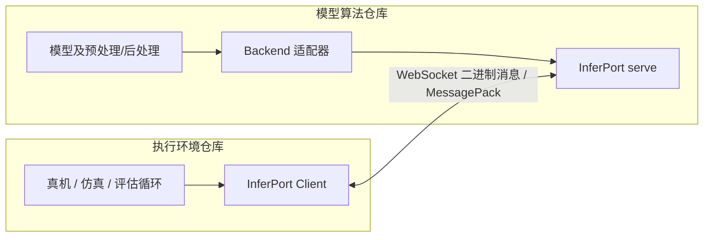
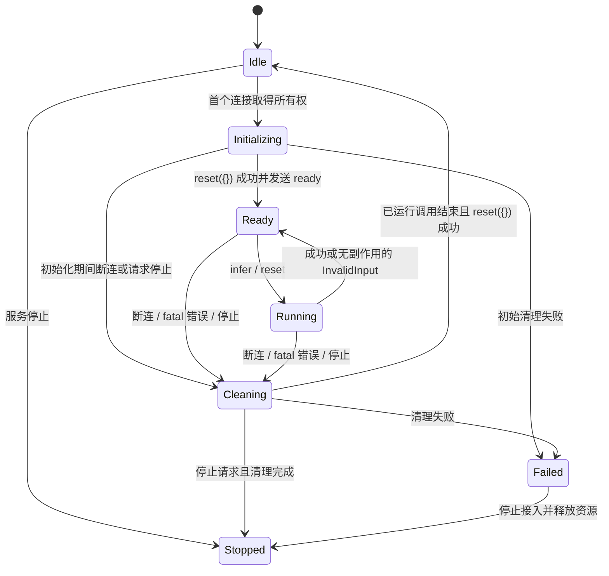

# InferPort 方案

日期：2026-09-26。状态：设计基线，尚未实现。

本文是从 `policy-runtime` 演进到 InferPort 的完整实现依据。名称、WebSocket + MessagePack、
Python 3.10 兼容下限、NumPy 1.26.4 / 2.x 兼容方向，以及一模型对一执行端的范围已经在讨论中确认。
下文将这些取舍落实为 API、线协议、状态规则、实现步骤和验收要求。
示例展示目标 API；当前仓库仍是原有 `policy_runtime` 实现，不能直接运行这些新示例。

本次只形成方案，不修改运行代码、不迁移其他仓库、不发布包、不提交或推送 Git。

## 1. 定位与完成标准

InferPort 是一个轻量的 Python 推理通信库。模型算法与执行环境分别安装它，通过少量适配代码交换数据。
模型端可以属于 LeRobot、mimix 或其他算法库；调用端可以是真机、仿真，也可以是离线评估程序。
接口支持 policy、value、Q、reward 等推理任务，核心不解释这些任务的业务含义。

首版的使用边界：

- 一个服务进程托管一个已加载的 `Backend`，同时只允许一个活动连接使用它。
- 一个 `Client` 同时执行一个调用；公开接口同步，调用方掌握自己的执行循环。
- 一次请求可以包含 batch。batch 的形状、每个元素的含义和批内状态由模型适配器定义。
- 数据为字符串键字典、基本值、列表和数值 NumPy 数组。请求与结果均以字典为根。
- 两端可以使用不同 Python、NumPy、模型框架和设备，只须遵守同一个线协议版本。
- 完成首版的标准是可安装的独立包、清晰的协议、可复现的功能与故障测试、可照着接入的示例。

首版范围之外：RTC 算法、动作队列与调度、机器人/环境基类、训练、自动 batch 聚合、
多个并发会话、多模型路由、流式生成、请求取消、自动重试、服务发现、通用 `describe()`、
schema DSL、传输插件和动态远程方法调用。这些能力不预留空框架。

## 2. 三个仓库的职责



| 所有者 | 负责的内容 |
|---|---|
| InferPort | 连接、请求响应、数组编码、协议版本、错误与生命周期 |
| 模型仓库 | 权重与设备、推理、模型状态、processor 状态、输入输出语义校验 |
| 执行仓库 | 观测采集、字段转换、动作消费、执行频率、设备控制与本地保护 |

模型适配器留在模型仓库，不放进 InferPort。执行端不必继承 `EnvAdapter` 或 `Robot`。
安装和导入 InferPort 不得加载 Torch、JAX、CUDA、LeRobot、ROS、Gymnasium 或机器人 SDK。

能传数组不等于模型适用于任意机器人。适配双方必须约定相机含义、RGB/BGR、HWC/CHW、
关节顺序、单位、坐标系、绝对/相对动作、时间维度和归一化归属；这些记录在适配器文档和测试里。
InferPort 不做隐式 resize、图像压缩、类型降精度、归一化、动作映射或 batch 维度推断。

## 3. 技术选型

### 3.1 一套传输与编码

- 网络传输：WebSocket，首版提供 `ws://` 和使用 TLS 的 `wss://`。
- Python 网络库：`websockets`。使用明确的 `websockets.asyncio` 导入路径。
- 编码：MessagePack。仅发送二进制业务消息。
- 数组表示：固定扩展类型承载 `dtype + shape + bytes`。
- 不保留原生 TCP/JSON 兼容通道，不同时实现 ZMQ 后端。

选型依据是当前一对一调用的维护成本：采用现成消息分帧与连接协议，把自有代码集中在推理契约。
不把未测量的性能优势、多客户端路由或未来 RTC 当作本次选型依据。
WebSocket 仍有帧处理、客户端掩码和缓冲成本，实际开销纳入第 12 节的基准。

### 3.2 同步公开 API，内部异步 I/O

调用方使用普通 `with`、`infer()` 和 `reset()`，不需要管理事件循环。

实现上，每个已连接的 `Client` 拥有一个后台 I/O 线程及事件循环；公开同步方法向该循环提交协程。
模型端的 `serve()` 管理一个网络事件循环，并将全部 Backend 方法交给一个固定的串行工作线程。
这一实现不能暴露为供用户选择的运行模式。

原因：检查 `websockets 16.1.1` 后确认同步 `send()` 没有独立超时参数，
只调用同步 `recv(timeout=...)` 无法覆盖发送阶段阻塞。异步 I/O 能为发送和等待回包设置共同截止时间，
同时避免慢推理阻塞网络心跳。实现只使用通信库的公开 API，不调用其内部 `close_socket()` 等方法。
参见 [同步接口](https://websockets.readthedocs.io/en/stable/reference/sync/client.html) 和
[异步接口](https://websockets.readthedocs.io/en/stable/reference/asyncio/client.html)。

### 3.3 Python、依赖和发布元数据

目标元数据：

```toml
[project]
name = "inferport"
requires-python = ">=3.10"
dependencies = [
    "numpy>=1.26.4,<3",
    "msgpack>=1.1,<2",
    "websockets>=16.1.1,<18",
]
```

这是首版待完整验证的依赖范围，不是声称该范围内所有组合均已测试。
发布前须完成最低组合、各 Python 兼容组合及最新组合测试；发现具体不兼容版本时使用明确的排除约束。

- CPython 3.10–3.14 是首版正式测试目标；开发基线为 3.12。
- 不支持 3.8/3.9，不预先设置 Python 上限；更新 Python 通过 CI 后再列入正式支持。
- NumPy 1.26.4 在 Python 3.10–3.12 上是重点兼容组合；3.13/3.14 使用支持相应 Python 的 NumPy 2.x。
- Python 3.10 解析到兼容的 websockets 16.x；新环境允许已验证的 17.x，不强迫两端版本相同。
- 运行依赖不能要求 NumPy 2.x 或精确锁死 1.26.4。已有项目锁定 1.26.4 时，应能同时满足依赖。
- 应用方锁定实际环境；仓库的开发锁文件不限制下游安装时的依赖选择。
- InferPort 自身发布纯 Python wheel，不编译自己的 C/CUDA 扩展，不依赖 NumPy C ABI。
- 首版不声明 PyPy、自由线程 Python 或 32 位平台支持；Linux x86_64 为运行验证基线，ARM64 做安装验证。

Python 3.10 将于 2026-10 结束上游支持。首个稳定系列覆盖 3.10；后续若它阻碍必要依赖更新，
提前在新功能版本中提高下限，补丁版本不突然取消支持。保留旧发行版的可安装性，
同一线协议版本的互通不依赖双方使用相同 SDK 版本。
参见 [Python 生命周期](https://devguide.python.org/versions/)、
[NumPy 1.26.4 支持范围](https://numpy.org/doc/2.1/release/1.26.4-notes.html) 和
[websockets 版本说明](https://websockets.readthedocs.io/en/stable/project/changelog.html)。

项目名、导入名和计划仓库名均为 `inferport` / InferPort。2026-09-26 查询 PyPI 的
`inferport` 项目元数据返回 404；这不等于名称已预留或一定获准注册。首次发布前再次检查。
开发版本从 `0.1.0` 开始；SDK 版本与线协议版本分别管理。

## 4. 公开 Python 接口

首版公开入口为 `Client`、`Backend`、`serve`，不增加公开的 Session、EnvAdapter、Server 或配置类。
以下签名属于目标接口；`Payload` 表示第 6 节规定的字符串键字典。

### 4.1 Backend

```python
class Backend(ABC):
    @abstractmethod
    def infer(self, inputs: Payload) -> Payload:
        ...

    def reset(self, context: Payload) -> None:
        pass

    def close(self) -> None:
        pass
```

- 用户继承 `Backend`；只要求实现 `infer()`。无状态 value/reward 后端可以完全忽略两个默认钩子。
- 模型加载通常放在构造或模型仓库自己的初始化代码中，每个服务进程只加载一次。
- 服务期间 Backend 由 serve 独占；调用方不得另开线程直接调用它，或在使用期间 fork 后复用 Client。
- `reset(context)` 清空本轮状态并完整替换上下文，不能只增量合并；空字典必须是合法的清理请求。
- 有状态后端必须覆盖模型、processor、缓存和自有动作队列的重置；权重无须重新加载。
- `close()` 在服务生命周期结束时释放后端资源，不在每次断连时卸载权重。
- 服务启动后的 `infer/reset/close` 均在同一个工作线程中串行调用；构造函数由调用方执行。
  构造与推理有线程亲和要求的框架，由适配器安排必要的延迟初始化。
- 可预期的输入问题抛出 `InvalidInput`，且必须在修改后端状态之前完成这类校验。

### 4.2 Client

```python
class Client:
    def __init__(
        self, uri: str, *, timeout: float = 30.0,
        open_timeout: float = 10.0,
        max_message_bytes: int = 64 * 1024 * 1024,
        token: str | None = None,
        ssl: SSLContext | None = None,
    ): ...

    def connect(self) -> Client: ...
    def infer(self, inputs: Payload, *, timeout: float | None = None) -> Payload: ...
    def reset(self, context: Payload | None = None, *, timeout: float | None = None) -> None: ...
    def close(self) -> None: ...
    def __enter__(self) -> Client: ...
    def __exit__(self, exc_type, exc, traceback) -> None: ...
```

构造不连接；`connect()` 或进入 `with` 后连接，并等待服务端初始化确认。已连接时重复 connect 无副作用。
尚未连接时调用 infer/reset 抛出 `RuntimeError`。关闭或故障后的对象不复用，重新创建 Client。
`close()` 幂等；不提供自动重连或自动重放。退出上下文不吞掉原异常。

所有业务方法要求同一调用方顺序使用；用非阻塞调用锁检测重入和并发调用并抛出 `RuntimeError`，
不默默堆积请求。跨线程主动 close 可以中断网络等待；它不能取消已经开始的服务端推理。
调用期间发生 KeyboardInterrupt 时也废弃连接，防止后续误读迟到结果。

`reset(None)` 等价于发送空上下文；单次方法的 `timeout=None` 表示使用 Client 默认值，不表示无限等待。
所有超时参数必须为有限正数。客户端只暴露连接超时和请求超时，关闭超时首版固定为 5 秒。

### 4.3 服务入口

```python
def serve(
    backend: Backend, *, host: str = "127.0.0.1", port: int = 8000,
    token: str | None = None, ssl: SSLContext | None = None,
    max_message_bytes: int = 64 * 1024 * 1024,
    send_timeout: float = 30.0,
    stop_event: threading.Event | None = None,
) -> None:
    ...
```

阻塞运行，普通脚本直接调用。嵌入其他程序时可通过 stop_event 请求停止；命令行进程支持 Ctrl+C。
`serve()` 接管传入 Backend 的生命周期，从进入函数到退出统一负责调用一次 close，包括启动失败路径。
停止接入、关闭连接、等待实际后端工作结束和清理的顺序见第 8 节。
不为方便单个模型而加入动态 import、任意方法注册、模型路径远程配置或统一加载 CLI。

### 4.4 错误接口

| 类型 | 含义 |
|---|---|
| `Error` | InferPort 错误基类 |
| `TransportError` | 建连或连接中断、网络 I/O 失败 |
| `RequestTimeout` | 网络交换或就绪等待超过截止时间；含阶段信息，继承 TransportError |
| `ProtocolError` | 版本不匹配、非法消息、错误 ID、非法编码/数组等 |
| `RemoteError` | 服务端返回错误；具有 `code`、`message`、`request_id`、`fatal` 属性 |
| `InvalidInput` | Backend 可显式抛出的输入错误；SDK 客户端收到后映射为 RemoteError |

本地 payload 不受支持时抛出 `TypeError` / `ValueError`，在发送前失败且保留可用连接。
第三方网络库异常保留为异常链，不作为公共 API 要求调用方识别。

## 5. 接入示例与业务语义

### 5.1 一个可独立运行的数值后端

```python
import numpy as np
from inferport import Backend, InvalidInput, serve

class ValueBackend(Backend):
    def infer(self, inputs):
        state = inputs.get("state")
        if not isinstance(state, np.ndarray) or state.ndim != 2:
            raise InvalidInput("state must be an array with shape [B, D]")
        return {"value": np.sum(state * state, axis=-1)}

if __name__ == "__main__":
    serve(ValueBackend(), host="127.0.0.1", port=8000)
```

```python
import numpy as np
from inferport import Client

with Client("ws://127.0.0.1:8000") as client:
    result = client.infer({"state": np.ones((4, 7), dtype=np.float32)})
    print(result["value"])  # shape [4]
```

### 5.2 一个模型控制一个机器人或仿真环境

下列环境和权重加载函数由使用方提供，示例只说明职责：

```python
with Client("ws://model-host:8000") as client:
    env.reset()
    client.reset({"instruction": "pick up the object"})
    while not env.is_done():
        result = client.infer(make_model_inputs(env.get_observation()))
        execute_action_chunk(env, result["actions"])
```

`make_model_inputs()` 定义相机/状态对应关系；`execute_action_chunk()` 决定执行几步、频率和插值。
InferPort 不自动执行完整 chunk，也不在网络线程控制硬件。value/reward/Q 后端通常无须 reset。
`actions`、`state`、`instruction`、`value` 都是此处适配器的业务字段，不是协议保留字段。

LeRobot PI05 接入时复用现有权重与 processor 加载逻辑，把 `get_action` 改为 `infer`，
把输出包装为 `{"actions": array}`。重置必须覆盖实际有状态的 processor，不能只重置 policy。
图像类型转换、HWC/CHW、归一化和 Torch/NumPy 转换仍由适配器拥有。

## 6. 数据表示与数组编码

### 6.1 数据值集合

支持 `None`、bool、str、bytes、Python int、float、list、字符串键 dict、受支持的 ndarray。
发送方可以输入 tuple，接收方统一得到 list。NumPy bool/整数/浮点标量规范化成 Python 标量，
标量不承诺保留 NumPy dtype；需要保留 dtype 时使用零维 ndarray。

整数范围为 MessagePack 可表示的 `[-2**63, 2**64-1]`。Python float 使用 binary64；
NaN/Inf 可以传输，是否允许作为模型输入由 Backend 校验。
不支持任意 Python 对象、dataclass 自动还原、Tensor、object 数组、结构化 dtype、complex、
datetime/timedelta、字符串数组、bfloat16 或其他扩展 dtype。不能静默转换这些类型。
调用方需要时显式转换为已支持的数值数组；文本使用字符串或字符串列表。

根对象为 dict；嵌套 dict 的键也只能是 str。重复 map key、未知扩展类型必须拒绝。
不执行 pickle，不按网络中的名称导入模块或创建 Python 类。

### 6.2 ndarray 扩展类型

使用 MessagePack application extension code `1`，只保留这一种扩展。
其内容再次用 MessagePack 编码为长度严格为 3 的数组：

```text
ExtType(1, pack([dtype, shape, data]))

dtype: 规范化后的字符串
shape: 非负整数列表；[] 表示零维数组
data:  C 顺序的二进制 bytes
```

允许的 wire dtype 固定为：

```text
|b1 |i1 |u1
<i2 <u2 <i4 <u4 <i8 <u8
<f2 <f4 <f8
```

多字节数值在网络上统一为小端，单字节使用 `|`。发送方将大端或非连续输入规范化为该表示，
保持数值、数值类型宽度和 shape，不保留原始 strides、字节序、视图关系或子类信息。
接收方还原为本机字节序、C 连续、可写的普通 ndarray。这通常需要一次拷贝；
首版明确接受该成本，避免只读数组接入 Torch 或原地预处理时的隐患，不声称零拷贝。

解码顺序：先检查扩展结构与长度，再检查 dtype 白名单、shape，最后检查字节数并构建数组。
必须满足 `len(data) == math.prod(shape) * itemsize`。不接受 -1 维度推断、多余字节、
不足字节或把 bool 当作维度。零维按一个元素计算，含零维度的空数组数据长度为零。

MessagePack 的扩展类型避免数组标记与用户字典字段碰撞；格式中不出现 NumPy 私有类名称。
参见 [MessagePack 扩展类型规范](https://github.com/msgpack/msgpack/blob/master/spec.md)。

### 6.3 资源边界

- 完整消息（包括信封）默认最多 64 MiB；两端都检查发送和接收，数组不得超出此范围。
- 两端上限不自动协商；适配部署应设置一致上限。超限明确失败，不自动拆分成多个请求。
- 数组最多 32 维，维度必须为 `[0, 2**31-1]` 内整数；重建失败统一转换为 ProtocolError。
- 结构嵌套最多 32 层，基本容器节点总数最多 100,000；数组元素不逐个计入此数。
- 配置 msgpack 的字符串、二进制、扩展和容器长度限制；使用严格 map key / duplicate key 校验。
  网络大小限制在解码前生效；嵌套与总节点检查还需要结构遍历。
- 不承诺总进程内存小于消息上限：编码、解码、可写数组和 Python 容器均有额外内存开销。

## 7. WebSocket 与线协议 v1

### 7.1 连接与就绪

端点为 `/`。必须协商 WebSocket subprotocol `inferport.v1`；缺失或不匹配时拒绝连接。
不通过包版本字符串猜测兼容性，不静默回退为 JSON 或其他协议。

握手完成后，服务端尝试取得唯一活动连接的所有权。获得所有权后执行 `backend.reset({})`，
成功后发送保留 ID 为 0 的就绪响应：

```json
{"id": 0, "ok": true, "data": {}}
```

`Client.connect()` 收到并验证该响应后才返回。这个步骤仅确认状态已清理、后端可接受请求，
不携带模型名称、输入 schema、能力描述或任意 metadata。
第二个连接收到 ID 为 0 的 `busy` 错误，随后关闭，不排队，也不调用 Backend。

唯一所有权在握手后的连接处理器中原子取得，不能在 HTTP 握手开始时提前占住后又漏释放。
鉴权和子协议检查发生在取得所有权之前。失败连接不影响当前控制方。

### 7.2 请求和响应

以下用 JSON 记法展示结构；实际传输为 MessagePack binary。

```json
{"id": 1, "op": "reset", "data": {"instruction": "pick up the object"}}
{"id": 1, "ok": true, "data": {}}

{"id": 2, "op": "infer", "data": {"state": "<ndarray>"}}
{"id": 2, "ok": true, "data": {"actions": "<ndarray>"}}

{"id": 3, "ok": false, "error": {
  "code": "invalid_input",
  "message": "state must have shape [B, D]",
  "fatal": false
}}
```

- 请求 ID 为 `[1, 2**63-1]` 内整数，在一个连接内严格递增，不接受 bool、复用或倒退。
  ID 为 0 仅用于就绪/接入结果；达到上限后建立新连接，不绕回。
- 操作仅有 `infer` 与 `reset`。reset 成功响应 data 必须为空字典，infer 响应为 Backend 结果字典。
- 请求键严格为 id/op/data；成功响应为 id/ok/data；错误响应为 id/ok/error。
  不允许重复键、未知信封字段、错误字段类型或 ok 同时携带 data 和 error。
- error 的键严格为 code/message/fatal，类型分别为 str/str/bool；v1 只接受下表列出的线协议错误码。
  非 fatal 错误仅允许 invalid_input。握手阶段的 unauthorized 是本地映射，不属于业务错误信封。
- Client 必须验证 ID 对应关系和响应结构；不匹配即废弃连接，禁止把旧结果交给下一次调用。
- SDK 每次等待当前调用完成后再发下一个请求；不提供 pipeline 或响应重排功能。
  服务端始终按接收顺序串行执行，不能因为缓冲区中出现后续请求就并行调用 Backend。
- 不设置 episode_id、session_id 或 reset generation；一个活动连接和严格顺序构成首版状态边界。
- 不把诊断信息写入用户的结果字典，不预留任意 RPC endpoint 注册机制。

### 7.3 错误与关闭约定

| code / 情况 | fatal | 连接与后端处理 |
|---|---:|---|
| `busy`，仅 id=0 | true | 关闭新连接；不触碰活动连接及模型状态 |
| `invalid_input` | false | 发送错误；后端必须保证状态未改变，允许本连接继续调用 |
| `unsupported_operation` | true | 回复错误后关闭连接并清理 |
| `protocol_error`，能可靠取得 ID 时 | true | 尽力回复错误，关闭连接并清理 |
| `backend_error` | true | 后端异常，关闭当前连接；清理成功才允许重新接入 |
| `invalid_output` | true | 输出不是合法 Payload 或无法编码；关闭并清理 |
| 消息无法解码/没有可信 ID/文本业务帧 | — | 直接关闭，不构造虚假的请求 ID |
| 消息超过接收上限 | — | WebSocket 1009；中止当前连接并清理 |

正常关闭使用 1000；非法业务消息使用 1008；内部后端错误使用 1011；busy 使用 1013；
服务停止使用 1001。若已失去可写连接，记录原因并完成本地清理，不要求一定发出关闭帧。
这些代码用于通信诊断，不能代替业务错误信封。

意外异常返回固定、简短的信息，完整 traceback 留在服务端；不向客户端直接发送内部路径、token 或原始输入。
收到 fatal 错误后 Client 先标记不可用，再抛 RemoteError。非法错误信封按 ProtocolError 处理。

## 8. 生命周期、独占与超时

### 8.1 状态转换



Initializing、Ready、Running、Cleaning 期间，其他连接都收到 busy。
Running 转入 Cleaning 表示结果已不再交付，后端实际工作可能还在进行；必须等待其结束再清理。
整个过程仍持有独占权。清理失败时停止监听并让 serve 以错误退出，不继续复用未知状态的 Backend。

状态钩子的固定时点：连接取得所有权后 reset({})；显式 reset 按请求执行；
正常断连或故障断连后 reset({})；服务退出时 close() 一次。
无状态后端这些 reset 都是 no-op。初始 reset({}) 不能要求 instruction 等业务字段。

### 8.2 超时的准确含义

- `open_timeout` 覆盖 Client 发起建连、WebSocket 协商和等待 id=0 就绪响应。
- `timeout` 从本地输入校验和编码完成后开始，覆盖发送请求、服务端等待/推理和接收完整响应。
  本地编码及回包解码不计入该网络交换期限；不把它描述为硬实时的整个 Python 方法上限。
- 服务端 `send_timeout` 限制发送 ready、响应或错误的网络等待，不是强制中断模型计算的时限。
- 使用各自进程的 monotonic clock。首版不发送跨机器绝对截止时间，不依赖时钟同步。
- 超时时 Client 立即使连接不可复用，启动关闭并抛 RequestTimeout；网络资源清理另有最多 5 秒的关闭预算。
  系统调度和本地编解码仍可能增加方法耗时，不作硬实时保证。
- 不取消或重放服务端业务，不承诺 exactly-once。发送成功、TCP ACK 或心跳成功都不代表推理已成功完成。

I/O 实现用 Python 3.10 可用的异步等待机制覆盖 send+recv，并在失败路径关闭连接。
发送中断后的连接不得复用；不要仅取消 send 然后继续发下一条消息。
客户端后台循环不能运行用户预处理或 GPU 工作；编解码也应与网络循环隔离。

关闭必须有库外的期限保护。设计诊断发现，16.1.1 和 17.1 的异步 close 在对端停止读取且
写缓冲堵塞时，仍可能等待 drain，单靠库的 close_timeout 不足以限定总耗时。
实现通过公开的 create_connection 扩展点提供内部连接子类，在标准 connection_made 回调中
保留 asyncio transport；正常尝试关闭超过 5 秒后，调用该 transport 的公开 abort() 并收回关闭任务。
发送阶段已经超时可直接中断连接。客户端、服务端和库触发的正常关闭路径都必须经过该保护，
不能读写通信库私有字段。参见 [asyncio transport 接口](https://docs.python.org/3/library/asyncio-protocol.html)
及前述 websockets create_connection 文档。

进入上下文失败、请求超时或 fatal 错误也必须触发内部资源回收；不能依赖调用方再次 close，
更不能依赖 __del__ 清理后台循环。对本地编码失败和非 fatal InvalidInput 则保留连接。

### 8.3 服务端执行与停止

服务端始终保留实际工作 future 的所有权。网络任务取消不应让代码误判底层推理已经结束。
用独立的单线程 executor 依次执行 infer/reset/close；关闭处理不能与尚在执行的模型调用并发。
需要屏蔽网络取消对工作 future 的传播，等待实际执行结束，再提交清理。
服务端的大数组解码、后端调用和响应编码也排入这一串行工作线程，避免长时间占用网络循环。
收到断连后，不再启动已缓冲的新业务请求；已经开始的工作按上述规则收尾。

Ctrl+C 或 stop_event 的顺序：停止接受新控制连接、关闭现有连接、等待已开始调用结束、
清理状态、调用 Backend.close、停止工作线程与事件循环。拒绝接入和传输错误不杀死健康服务。

Python 线程中的阻塞 GPU/本地扩展调用无法被安全强杀。若 Backend 永久挂起，
客户端仍能超时，但服务保持不可重新接入，正常关闭也可能等待；外部进程管理负责最终终止和重启。
首版不引入可杀死的模型子进程，也不宣称可以安全恢复任意 CUDA 错误。

## 9. 默认配置与安全边界

| 项目 | 首版默认 |
|---|---|
| 服务绑定 | 127.0.0.1:8000，跨机器时由启动程序显式配置 |
| 连接形式 | 长连接；每个连接一个活动调用 |
| WebSocket 压缩 | 关闭，compression=None |
| 系统代理 | 关闭，proxy=None；首版面向直接连接 |
| 最大完整消息 | 64 MiB，两端收发都限制 |
| 接收队列 | 设置较低的有限水位，不使用无限队列；首版 max_queue=1 |
| 网络心跳 | ping_interval=20 秒，ping_timeout=20 秒 |
| 正常关闭预算 | 5 秒 |
| 连接/就绪等待 | 10 秒，可配置 |
| 请求交换期限 | 30 秒，可按 Client 和单次调用配置 |

WebSocket 的 max_queue 是帧水位而非严格的请求数量或进程内存上限；不能据此声称只有一条消息占内存。
心跳只用于连接活性判断，不检测模型是否卡死，也不承担机器人控制周期计时。
默认值依据 [websockets 接口与缓冲说明](https://websockets.readthedocs.io/en/stable/topics/memory.html)
进行显式配置，不继承压缩和系统代理默认行为。

首版提供可选 bearer token：Client 在握手 Authorization 头携带；服务端配置 token 后必须校验，
使用常量时间比较，不放入 URL、业务 payload 或日志。认证失败在升级前返回 HTTP 401，
Client 映射为 code=unauthorized 的 RemoteError，request_id=None。
已明确的子协议协商失败映射为 ProtocolError，其他 HTTP/网络建连失败映射为 TransportError。

Client 的 wss 默认验证证书和主机名，可传 SSLContext 配置私有 CA；服务端 SSLContext 由启动程序加载证书。
ws 不提供加密，token 本身也不能加密消息；跨不可信网络使用 wss 或已有的可信加密隧道。
参见 [TLS 配置](https://websockets.readthedocs.io/en/stable/howto/encryption.html)。
首版拒绝携带浏览器 Origin 的握手，仅支持直接程序客户端；Origin 检查不替代身份认证。

使用标准 logging，默认记录连接/断连、请求 ID、操作、耗时和错误码；不默认记录图像、完整数组、
指令正文或密钥。不加入遥测、模型清单接口或通过网络加载代码的能力。

## 10. 仓库结构与旧代码处理

目标目录：

```text
pyproject.toml
README.md
LICENSE
docs/
  inferport-design.md       # 本设计的唯一详细版本
src/inferport/
  __init__.py              # 公共导出
  backend.py               # Backend 与 Payload 类型
  client.py                # 同步 Client 门面与连接生命周期
  server.py                # serve 与单后端执行/清理
  protocol.py              # v1 消息结构、校验和错误映射
  codec.py                 # MessagePack / ndarray 格式与限制
  errors.py                # 公共异常
  _io.py                   # 私有 I/O 循环、deadline 和关闭助手
examples/
  serve_value.py
  call_value.py
  stateful_counter.py
tests/
  test_codec.py
  test_protocol.py
  test_lifecycle.py
  test_transport.py
  test_packaging.py
benchmarks/
  roundtrip.py
.github/workflows/
  ci.yml
```

模块划分可以在实现时小幅调整，但不引入通用 transport 注册表、Session manager、插件发现或额外配置框架。
运行依赖仅为第 3 节的三个包；测试、lint、构建依赖单独放入开发组，执行优先使用 uv。

用户已明确没有旧 API 兼容负担。实现时直接替换包名、导入路径和 README，删除已被替代的旧模块，
不添加 `policy_runtime` 兼容别名或维护两套线协议。目录/远程仓库改名不属于协议实现所必需的操作，
当前可以继续在 policy-runtime 目录开发；Git 提交、远程改名和 PyPI 发布分别按实际请求执行。

已有代码的处置：

| 旧内容 | 目标 |
|---|---|
| PolicyAdapter | 迁为 Backend；infer / reset / close |
| EnvAdapter + run_client | 控制循环回到调用仓库，通用库保留薄 Client |
| JsonSocket / 长度头 / Base64 | 由 WebSocket + 新 codec 替代 |
| start_episode / get_action / end_episode | 改为连接生命周期 + reset / infer |
| episode_id | 移除未落实的会话语义，采用连接独占与请求 ID |
| CLI 动态 import 工具 | 移除；模型仓库提供启动脚本 |

本地 Gitee LeRobot 中存在真实 PI05 适配器，以及与旧独立库重复的 policy_runtime 核心。
后续接入必须从 `inferport` 导入 Backend，不能仅改安装依赖而继续继承旧的独立类。
迁移完成后，公共通信实现以 InferPort 为唯一来源；其他仓库的删改在相应接入工作中执行。
本方案不把另一仓库的实验、任务编号或机器路径作为本库验收的隐含前置条件。

## 11. 实施顺序与交付物

| 阶段 | 工作 | 可检查的交付物 |
|---|---|---|
| A：包与数据契约 | 新包骨架、依赖、错误、codec、v1 消息校验 | 可构建 wheel；codec/protocol 正反例通过 |
| B：通信与状态 | Client、serve、ready、独占、工作线程、超时与关闭 | 独立进程调用和生命周期故障测试通过 |
| C：安装与示例 | 文档、无状态与有状态示例、跨版本与安装矩阵 | 干净环境可安装；无模型依赖调用成功 |
| D：性能与首版复核 | 固定 payload 基准、限制检查、打包内容审阅 | 有可复现结果，明确仍存在的验证缺口 |
| E：外部真实适配 | 在模型/执行仓库接入 PI05 等选定后端 | 模型、processor 和环境语义由所属仓库验证 |

A–D 构成独立库首版实现。E 是独立的集成验证工作，已有适配器可作为首个候选；
真机、权重、设备或第二个实际模型未指定时，不能用 mock 测试宣称已完成这些集成。
不要求先接入多种真实机器人才能完成协议库，但也不以协议库测试代替闭环验证。

## 12. 验证与验收

### 12.1 必须通过的功能与失败测试

| 范围 | 必须验证的行为 |
|---|---|
| 数据 | 所有允许 dtype、NumPy/Python 标量、嵌套值、空数组、零维、非连续切片、大小端输入、NaN/Inf |
| 编码边界 | shape/dtype/bytes 精确一致；负维度、额外字节、未知 ext、重复键、非法 dtype 和超限结构被拒绝 |
| 数组契约 | 接收数组可写、C 连续、本机字节序；dtype 宽度、shape 和数值保持 |
| 基本调用 | 两个独立进程传图像、状态和 batch；无状态后端无需 reset；有状态后端可显式 reset |
| 唯一接入 | 第二个连接收到 busy；认证/版本失败不触碰状态；所有权无泄漏 |
| 请求对应 | 错误 ID、倒序/重复请求 ID、错误响应结构触发 ProtocolError，结果不交给错误请求 |
| 重置 | reset 完成前不执行后续 infer；上下文完整替换；模型和 processor 状态同时清理 |
| 断连 | 正常 close、传输中断、推理中断连均只在实际计算结束后清理；清理前拒绝新连接 |
| 异常 | InvalidInput 不改变状态且可继续；意外后端异常/非法输出关闭当前连接；清理失败停止服务 |
| 超时 | 无服务、握手不完成、ready 不返回、对端停止读取、推理过慢、响应中断；发送阶段也有截止时间 |
| 迟到结果 | 超时后连接永久失效、不自动重放；旧结果不进入新连接；旧计算完成前不复用后端 |
| 关闭 | stop_event / Ctrl+C / 建连失败 / 认证失败 / 编码失败路径无长期遗留线程、socket 或占用端口 |
| 安全边界 | TLS 验证、错误 token、浏览器 Origin 拒绝、非法消息隔离、日志不记录敏感 payload |
| 无隐藏耦合 | 只装三个运行依赖即可 import、启动数值后端并调用；测试不依赖 Torch/机器人 SDK |

网络失败测试使用有明确同步点的可控 peer，避免单纯依赖短 sleep 制造竞态。
阻塞 Backend 测试用事件解除阻塞，验证清理顺序和独占；不在测试进程留下无法退出的线程。
对端停止读取测试要发送超过 socket 缓冲容量的数据，真正覆盖发送阻塞，不能只模拟慢模型。
还要覆盖关闭帧本身无法写出、接入中途断连和库内部发起 close 的路径，验证外层期限及 abort 回收。

### 12.2 兼容与打包矩阵

- 每个正式支持的 Python 版本运行核心功能测试，依赖解析为该解释器兼容的版本。
- Python 3.10 + NumPy 1.26.4 + msgpack 1.1.0 + websockets 16.1.1 验证最低组合。
- Python 3.12 + NumPy 1.26.4 验证常见训练环境；NumPy 2.x 与较新 websockets 验证新环境。
- 至少一次真实的双进程跨环境调用：Python 3.10 / NumPy 1.26.4 与 Python 3.12 / NumPy 2.x，
  交换客户端和服务端角色各测一次；仅交换序列化文件不足以代替网络互通测试。
- 从构建的 wheel 安装并运行示例，检查 Requires-Python、Requires-Dist、导出和 wheel 内容。
- 已锁定 NumPy 1.26.4 的环境安装 SDK 后仍满足该约束；干净环境可自动安装兼容依赖。
- Linux ARM64 验证可解析到兼容 wheel，明确记录这不等于已在真实机器人设备上运行。
- Windows/macOS 做安装和基础运行 smoke；未实际完成的平台检查不能标记为通过。

### 12.3 性能记录

基准保持相同 payload、MessagePack codec、请求节奏和模型替身；单独比较旧 JSON/Base64 编码。
如比较原生 TCP 与 WebSocket，原生 TCP 基线也使用二进制 codec、长连接和合理 socket 设置，
避免把 Base64 或 Nagle 配置差异归因于 WebSocket。

至少覆盖：小状态/动作消息、单张 224×224 RGB、多张 640×480 RGB、明确大小的 batch、接近配置上限的消息。
记录环境、版本、消息字节数、编码/解码耗时、往返 p50/p95/p99、吞吐、CPU 和峰值内存；
将本机回环与实际网络、空后端与真实模型推理分开。

没有用户给定的延迟预算，首版不虚构“必须 <1 ms”或“比其他方案快”的验收数字。
要求结果可复现、无随调用次数持续增长的资源泄漏、明确消息上限内的大数组成本，
发现明显异常尾延迟或内存增长时先定位并记录，不能用平均值掩盖。

## 13. 已有证据与剩余缺口

以下是设计阶段的临时诊断，均不表示 InferPort 已实现：

- 旧 policy-runtime 的双进程数值调用成功；畸形 JSON 可使服务端退出，断连未调用 end_episode，
  episode_id 与调用顺序也未受到验证。它证明分离思路可行，同时存在需要替换的生命周期缺口。
- 同一张 224×224×3 uint8 图像，原始数组 150,528 字节，旧 JSON/Base64 消息 200,794 字节，
  OpenPI MessagePack 消息 150,585 字节；减少约 25% 是编码体积收益，不能等同于网络或模型加速。
- OpenPI 编码在 Python 3.10 / NumPy 1.26.4 与 Python 3.12 / NumPy 2.4.4 上通过 20 类数组往返，
  做过跨环境文件解码；其解码存在接受多余字节、-1 维度、收发 dtype 规则不一致和标记字典碰撞的问题。
- 临时 WebSocket 示例完成约 1.84 MB 数组回环、接收超时与显式重连。这些测试未覆盖本设计的
  完整客户端实现、TLS、状态清理、新数组扩展格式或所有 Python 版本。
- 本轮新增“不再读取数据的对端”诊断：16 MiB 发送使用 0.2 秒期限。直接依赖库的 close_timeout
  时关闭等待未结束；采用公开连接扩展点保留 transport、额外 0.1 秒关闭预算并 abort 后，
  Python 3.10 / websockets 16.1.1 和 Python 3.12 / websockets 17.1 都在约 0.30 秒完成退出。
  这验证了有界网络回收的实现路径，不能替代最终 SDK 的全链路故障测试。
- 候选依赖做过部分 Linux x86_64 / ARM64 二进制解析；这不代替目标 wheel 的安装和运行矩阵。
- 当前没有真实模型、仿真闭环或真机性能结果，也没有原生 TCP 与 WebSocket 的公平网络性能比较。

设计借鉴与适用范围：

| 参考 | 采用的经验 | 留在原项目/暂缓的部分 |
|---|---|---|
| OpenPI | 独立轻客户端、二进制数组表示 | 不照搬无限消息大小、模型共享状态或 codec 的宽松解码 |
| GR00T | 薄模型包装、明确 reset 与错误返回 | 不采用其模型类耦合、任意 endpoint 注册或 ZMQ 传输 |
| LeRobot | 模型/执行分离、processor 状态需要被重置 | Robot 类、执行队列、RTC、gRPC 服务结构 |

源码依据：
[OpenPI 数组编码](https://github.com/Physical-Intelligence/openpi/blob/215abfb217dbac7d5f1273282331b9b1866c0479/packages/openpi-client/src/openpi_client/msgpack_numpy.py)、
[OpenPI 服务端](https://github.com/Physical-Intelligence/openpi/blob/215abfb217dbac7d5f1273282331b9b1866c0479/src/openpi/serving/websocket_policy_server.py)、
[GR00T 服务接口](https://github.com/NVIDIA/Isaac-GR00T/blob/51d4c89f72fda44cbf77285c6a8114b52676b8a1/gr00t/policy/server_client.py)、
[LeRobot 异步客户端](https://github.com/huggingface/lerobot/blob/1bc0bdfb20ad4f4f76dc8a68a0e0746d54f50de9/src/lerobot/async_inference/robot_client.py)。

本文取代早期讨论中关于名称、传输待定、通用 schema、可选调度运行时和 episode 接口的建议，
作为 InferPort 首版的新设计基线；外部仓库原有实现事实不因此改变。
